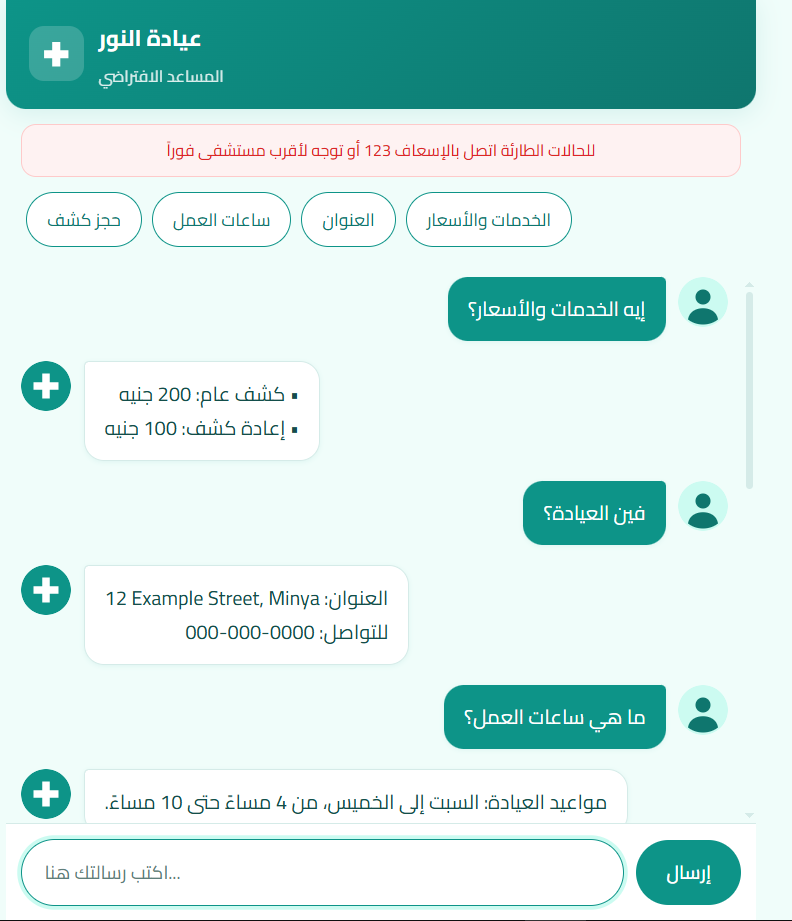
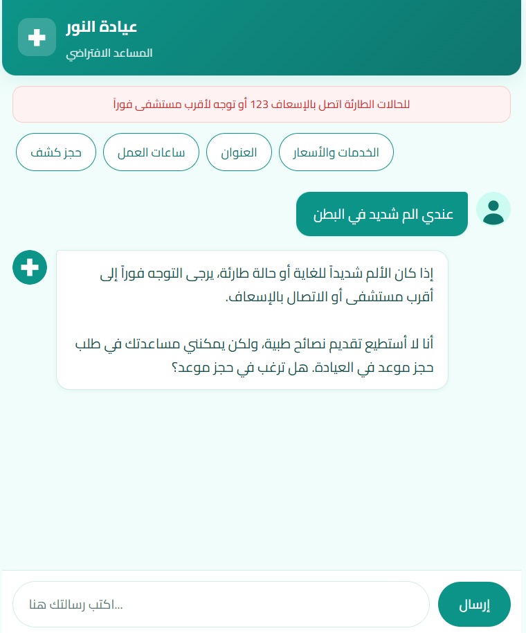
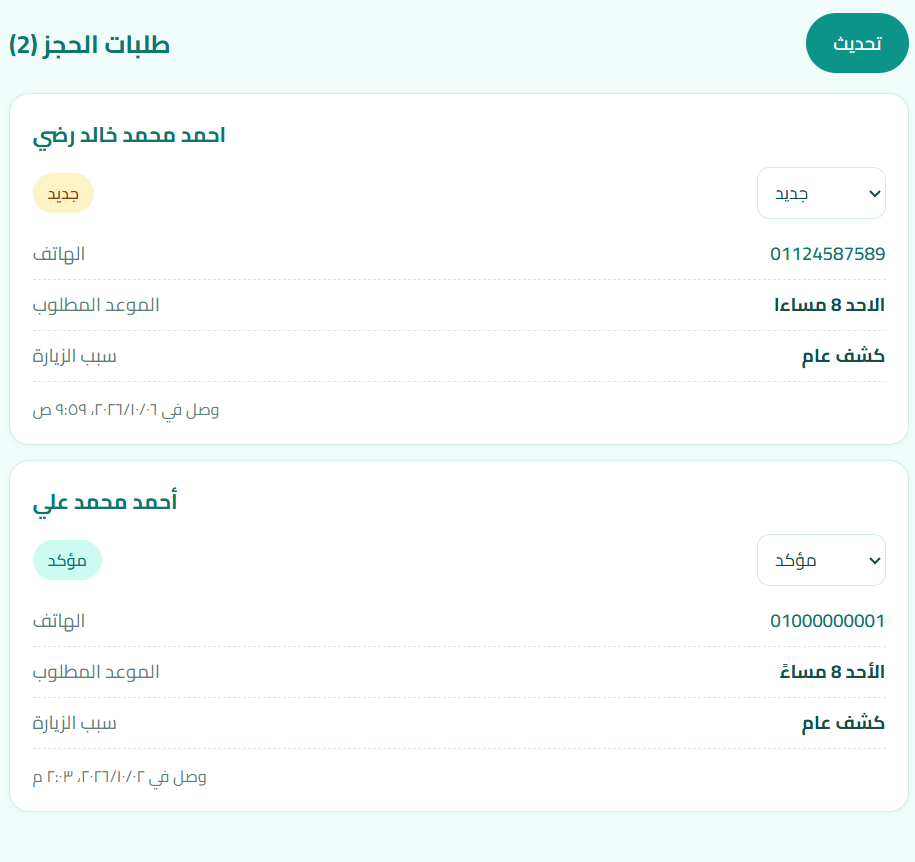

# Al-Noor Clinic Assistant

An Arabic/English clinic chatbot that answers patient questions, collects appointment requests, and gives clinic staff a dashboard to follow them up.

**Live demo:** [your-vercel-link]



## What it does

- Answers FAQs (hours, address, services, prices) in the patient's language.
- Collects appointment requests one detail at a time (name, phone, preferred time, reason), shows a summary, and saves the request after the patient confirms.
- Refuses to diagnose or recommend medication, and redirects emergencies to emergency services.
- Quick-reply buttons that answer common questions instantly without calling the AI.
- Staff dashboard to review requests and track their status (new, contacted, confirmed, cancelled).



## Tech stack

- **Frontend:** React, Vite, CSS (RTL-aware, Arabic typography)
- **Backend:** Node.js, Express
- **Database:** PostgreSQL (Neon)
- **AI:** Gemini through an OpenAI-compatible API, using function calling
- **Hosting:** Vercel

## Design decisions

- **API key stays on the server.** The browser only talks to `/api/chat`; the system prompt and keys are never exposed.
- **The AI cannot confirm appointments.** After the patient confirms the summary, the model calls a `create_booking` function; the server saves the request and replies with a fixed message saying the clinic will call to confirm. This prevents the model from promising times it cannot know.
- **Safety rules in the system prompt:** no diagnosis, no medication advice, emergency redirect, no guessing missing information.
- **Input validation and rate limiting** on the chat and admin endpoints; only `user` and `assistant` roles are accepted from the client.
- **Admin endpoints protected** by a secret key sent in a request header; SQL queries are parameterized.



## Run locally

```bash
git clone [your-repo-link]
cd clinic-chatbot
npm install
```

Create `server/.env`:

```
OPENAI_API_KEY=your-key
OPENAI_BASE_URL=https://generativelanguage.googleapis.com/v1beta/openai/
OPENAI_MODEL=your-model-name
DATABASE_URL=your-postgres-connection-string
ADMIN_KEY=a-long-random-string
```

Then create the table and start both servers:

```bash
node server/setup-db.js
npm run dev --prefix server
npm run dev
```

The dashboard is at `/#/admin`.

## Limitations

- Demo project: use fake data only. Real patient data needs consent, encryption, and a compliant host.
- The free AI tier has a small daily quota, so the bot may reply that it is busy.
- The free hosting tier may be slow on the first request after idle time.
- Single shared admin key; a real deployment would use proper user accounts.
